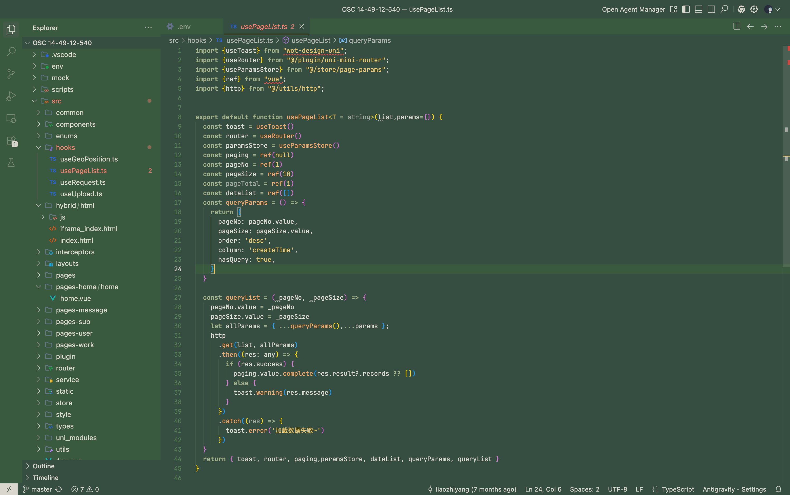
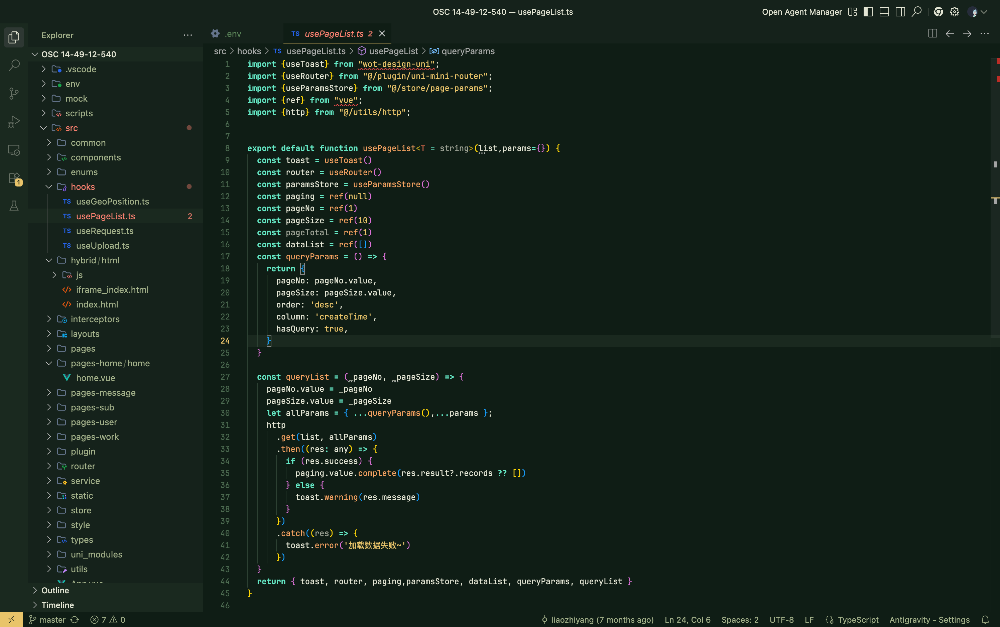
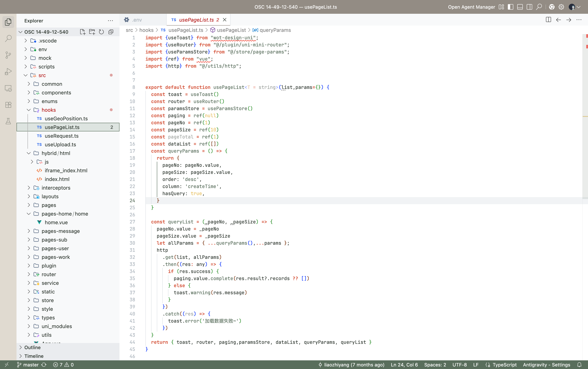

# QiHui Tech Theme

A professional, forest-inspired dark theme for Visual Studio Code.

## Features

- **Forest Green Palette**: A soothing, Morandi green background (`#344E41`) that is easy on the eyes.
- **Vibrant Highlights**: Strategic use of Sage Green, Autumn Yellow, and Sunset Orange for code readability.
- **Deep Immersion**: darker sidebars and activity bars help focus attention on the code.

## Colors

- **Background**: `#344E41` (Deep Forest)
- **Foreground**: `#DAD7CD` (Soft White)
- **Accents**: `#E9C46A` (Autumn Leaf), `#F4A261` (Sunset), `#A3B18A` (Sage)

## Screenshots

### QiHui Tech (Dark)

### QiHui Tech Night

### QiHui Tech Light

## Installation

1. Download the `.vsix` file.
2. In VS Code, go to Extensions (`Cmd+Shift+X`).
3. Click the `...` menu (Views and More Actions) at the top right.
4. Select "Install from VSIX...".
5. Choose the downloaded file.
6. Select "QiHui Tech" from the theme list (`Cmd+K Cmd+T`).

Enjoy your coding in the forest!
